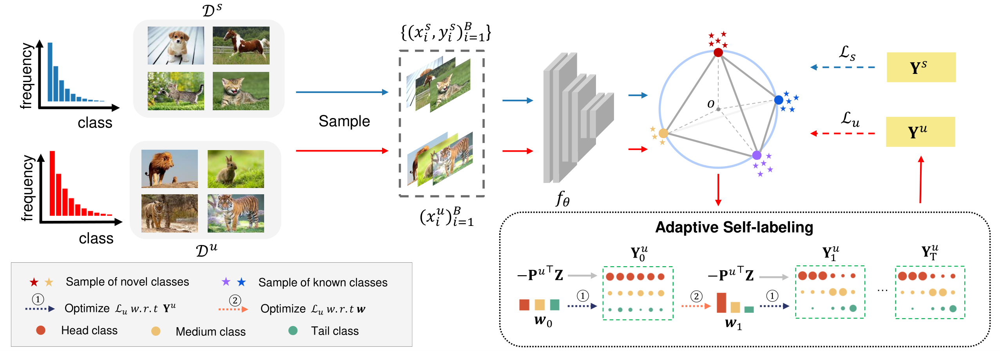

# Novel Class Discovery for Long-tailed Recognition (TMLR2023)
> Paper link: [Arxiv](https://arxiv.org/abs/2308.02989)
> 
> Novel Class Discovery for Long-tailed Recognition
> 
> Chuyu Zhang*, Ruijie Xu*, Xuming He
> 
> (The first two authors contribute equally).

> While the novel class discovery has achieved great success, existing methods usually evaluate their algorithms on balanced datasets. However, in real-world visual recognition tasks, the class distribution of a dataset is often long-tailed, making it challenging to apply those methods. In this paper, we propose a more realistic setting for novel class discovery where the distribution of novel and known classes is long-tailed. The challenge of this new problem is to discover novel classes with the help of known classes under an imbalanced class scenario. To discover imbalanced novel classes efficiently, we propose an adaptive self-labeling strategy based on an equiangular prototype representation. Our method infers better pseudo-labels for the novel classes by solving a relaxed optimal transport problem and effectively mitigates the biases in learning the known and novel classes. The extensive results on CIFAR100, ImageNet100, the challenging Herbarium19 and large-scale iNaturalist18 datasets demonstrate the superiority of our method.

<style>
figure {
  text-align: center;
}

figcaption {
  display: block;
  margin: 0 auto;
}
</style>
<figure>
  
  <figcaption>The diagram of our method</figcaption>
</figure>


## Prerequisites
### Env
Our project is built on pytorch.
To install the required packages, you can create a conda environment:

```sh
conda create --name ncdlt python=3.8
```

then use pip to install required packages:

```sh
pip install -r requirements.txt
```

We log the training by wandb. You have to fill in your wandb key in **train.py**.

<!-- USAGE EXAMPLES -->
### Datasets
You have to download CIFAR, ImageNet, [Herbarium19](https://www.kaggle.com/c/herbarium-2019-fgvc6) and [iNaturalist18](https://github.com/visipedia/inat_comp/tree/master/2018) from their official site. And then modify the path in **config.py** for each dataset.

### Pretrain Model
You have to first download the unsupervise pretrained ViT-B16 model from [DINO's](https://github.com/facebookresearch/dino) repo. And then modify the path in **config.py** for pretrained model.

## Training

Modify the name of yaml to train.

```sh
python train.py --c config/{name_of_yaml}.yaml
```

*We encourage you to do research on iNaturalist18 dataset which is more realistic and challenging.*

## Evaluation

After trianing, you can check the evaluation performance on training logs, or running evaluation script:

```
python eval.py --c config/{name_of_yaml}.yaml
```

## Acknowledgement
We thank the code provided by https://github.com/sgvaze/generalized-category-discovery .

## Citation


If you find our work is useful, please cite our paper:

```
@InProceedings{chuyu2023novel,
    author    = {Chuyu Zhang, Ruijie Xu, Xuming He},
    title     = {Novel Class Discovery for Long-tailed Recognition},
    booktitle = {Transactions on Machine Learning Research (TMLR2023)},
    year      = {2023}
}
```


And you can also check other work in our group.

```
@InProceedings{peiyan2023class,
    author    = {Peiyan Gu, Chuyu Zhang, Ruijie Xu,Xuming He},
    title     = {Class-relation Knowledge Distillation for Novel Class Discovery},
    booktitle = {Proceedings of the IEEE/CVF International Conference on Computer Vision (ICCV)},
    year      = {2023}
}